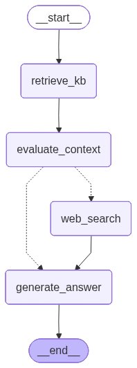

# AgentTuring Math Tutor 🤖📐

An AI-powered **mathematics tutoring assistant** combining **Retrieval-Augmented Generation (RAG)** with **Model Context Protocol (MCP)** web search.  
Built using cutting-edge AI architectures—**LangGraph**, **Qdrant**, and **Tavily MCP**—with strong privacy and safety guardrails.

---

## 🚀 Features

- **Step-by-step mathematical problem solving** using Qwen 2.5 LLM fine-tuned for math instructions.
- **Knowledge Base retrieval** with vector search on MetaMathQA and Math-Step-DPO-10K datasets.
- **Dynamic fallback to Tavily MCP web search** for up-to-date or out-of-knowledge queries.
- **Input/Output guardrails** to filter toxic content and PII, enforcing math-only queries.
- **React frontend** with LaTeX and Markdown rendering for rich math display.
- **Fully modular and extensible LangGraph pipeline** orchestrating retrieval, search, and generation.

---

## 📂 Project Structure


```
agentturing/           \# Backend codebase
├─ constants/        \# Model names and required path variables
├─ database/         \# KB construction, vectorstore management
├─ guardrails/       \# Guardrails for Input/output content safety
├─ model/            \# LLM and embeddings loader
├─ pipelines/        \# LangGraph RAG pipeline definitions
├─ prompts/          \# System prompt template
├─ utils/            \# Helper, output sanitization functions

agentturing-frontend/  \# React frontend with chat UI and rendering
app.py                 \# FastAPI backend serving API endpoints
logs/                  \# Runtime and error logs
.env                   \# API Credentials, not pushed to Github
save_graph_as_image.py \# Utility to visualize LangGraph pipeline as image
requirements.txt       \# Python dependencies
```

## Workflow Graph


---

## 🔥 Setup & Installation

1. Clone the repo:
```

git clone https://github.com/phantom-vk/agentturing.git
cd agentturing

```

2. Create & activate virtual environment:
```

python3 -m venv .venv
source .venv/bin/activate
pip install -r requirements.txt

```

3. Configure environment variables in `.env`:
```

TAVILY_API_KEY=your_tavily_api_key
OTHER_API_KEYS=...

```

4. Ingest datasets into Qdrant KB:
```

from agentturing.database.setup_knowledgebase import build_knowledge_base
build_knowledge_base()

```

5. Run the FastAPI backend:
```

uvicorn app:app --reload

```

6. Start React frontend:
```

cd ../agentturing-frontend
npm install
npm run dev

```

---

## ⚙️ How It Works

1. User types math question in frontend → sent to backend.  
2. Backend validates input for safety & math intent.  
3. Initial LLM generation tries direct answer without context.  
4. If uncertain, KB retrieval for relevant context is performed.  
5. If KB can’t help, Tavily MCP web search supplements context.  
6. Final generation combines context to deliver step-by-step answers.  
7. Output guardrails ensure safety and privacy before response.  
8. UI renders results with math and markdown beautifully.

---

## 🧪 Sample Questions to Try

- Explain the concept of p-adic numbers  
- Find the critical points of \( f(x) = x^3 - 3x^2 + 2 \)  
- What is the integral of \( e^{-x}x^3 \) from 0 to 1?  
- How many times in July do both a bookstore (sale every 5 days) and shoe store (sale every 6 days) have sales on the same date?  
- What is love in mathematics?

---

## 🌱 Future Work

- Implement **Human-in-the-Loop feedback** with DSPy integration for continuous learning from user corrections.  
- Expand KB with more datasets and domains.  
- Improve reasoning by fine-tuning with domain-specific datasets.

---


## ✉️ Contact

Created by Vikramaditya – [vikramadityakhupse@gmail.com]  
Feedback welcome!

---

⭐ If you find this project useful, please give it a star!


